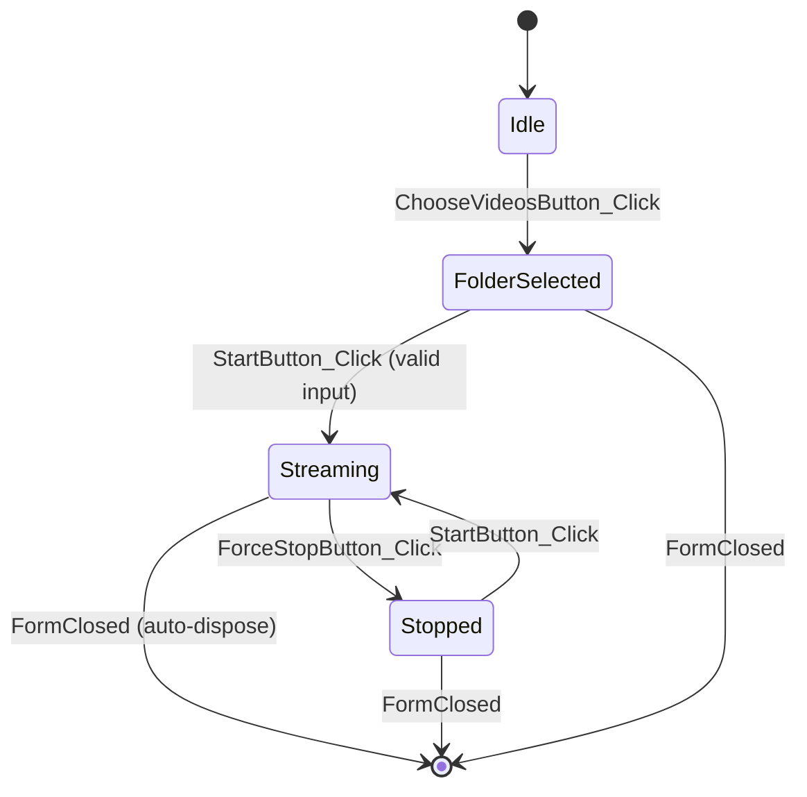

# `Form1` class

**Files:** [`EZInfiniteYTLive/Form1.cs`](https://github.com/havaianasdestruido/EZInfiniteYTLive/blob/main/EZInfiniteYTLive/Form1.cs) (logic) and `Form1.Designer.cs` (generated layout)
**Namespace:** `EZInfiniteYTLive`
**Type:** `public partial class Form1 : Form`

`Form1` is the application's single window. It is a thin controller: it reads/validates user input, and delegates all actual streaming work to a [`VideoStreamer`](./video-streamer.md) instance that it owns.

## Fields

| Field | Type | Default | Description |
|---|---|---|---|
| `_videoFolder` | `string` | `string.Empty` | Absolute path to the folder of videos chosen via **Choose Videos**. |
| `_streamer` | `VideoStreamer` | `null` | The currently active streaming engine instance, or `null` when idle. |
| `_shuffle` | `bool` | `false` | Tracks whether the user selected **RandOrder?**. *(See [Known Limitations](./video-streamer.md#known-limitations) — this flag is currently not consumed by `VideoStreamer`.)* |
| `_ffmpegPath` | `string` | `"ffmpeg.exe"` | Path/command used to invoke FFmpeg. Comment in source: `// Adjust if needed`. Relies on `ffmpeg.exe` being resolvable via the system `PATH`. |

## Designer-generated controls

These are defined in `Form1.Designer.cs` and referenced by the logic in `Form1.cs`:

| Control | Type | Notes |
|---|---|---|
| `RMTPUrl` | `TextBox` | Pre-filled with `rtmp://a.rtmp.youtube.com/live2`. |
| `StreamKey` | `TextBox` | `PasswordChar = '*'` masks the input. |
| `ChooseVideosButton` | `Button` | Text: "Choose Videos". |
| `StartButton` | `Button` | Text: "START". |
| `ForceStopButton` | `Button` | Text: "STOP". |
| `StatusLabel` | `Label` | Shows current app status. |
| `ShuffleRadio` | `RadioButton` | Text: "RandOrder?". |
| `AlphabeticOrderRadio` | `RadioButton` | Text: "AlphabeticOrder?"; `TabStop = true` and checked by default (set in the `Form1` constructor). |

## Constructor

### `Form1()`

```csharp
public Form1()
{
    InitializeComponent();
    StatusLabel.Text = "Idle";
    this.Text = "EZ Infinite YT Live - Idle";
    this.FormClosed += (s, e) =>
    {
        if (_streamer != null)
        {
            _streamer.Dispose();
        }
    };
    AlphabeticOrderRadio.Checked = true;
}
```

- Calls `InitializeComponent()` to build the designer-defined UI.
- Initializes the status label and window title to reflect an idle state.
- Registers a `FormClosed` handler that disposes the active `VideoStreamer` when the window is closed. Disposal requests a stop (`_stopRequested = true`) and kills whichever FFmpeg process is already assigned to `_ffmpegProcess` at that moment — see [`VideoStreamer.StopStreaming()`](./video-streamer.md#stopstreaming) for the startup race that means this doesn't *guarantee* an in-flight FFmpeg process is cleaned up if disposal happens to race with a new file starting.
- Defaults the playback order to **alphabetic** by checking `AlphabeticOrderRadio`.

## Event handlers

### `ChooseVideosButton_Click`

```csharp
private void ChooseVideosButton_Click(object sender, EventArgs e)
```

Opens a `FolderBrowserDialog`. If the user confirms a selection:
- Stores the chosen path in `_videoFolder`.
- Updates `StatusLabel.Text` to `"Selected: {_videoFolder}"`.

### `StartButton_Click`

```csharp
private void StartButton_Click(object sender, EventArgs e)
```

Validates input and starts a stream:

1. Returns early with a `MessageBox` error if `_videoFolder` is empty or the directory no longer exists.
2. Reads and trims `RMTPUrl.Text` and `StreamKey.Text`.
3. Returns early with a `MessageBox` error if either the RTMP URL or stream key is empty.
4. Builds `fullRtmp`: concatenates the RTMP URL and stream key, inserting a `/` separator only if the URL doesn't already end with one:
   ```csharp
   string fullRtmp = rtmpUrl.EndsWith("/") ? rtmpUrl + streamKey : rtmpUrl + "/" + streamKey;
   ```
5. Disposes any pre-existing `_streamer` (defensive cleanup).
6. Constructs a new `VideoStreamer(_ffmpegPath, _videoFolder, fullRtmp)`.
7. Updates UI state: `StatusLabel.Text = "Streaming..."`, disables `StartButton`, enables `ForceStopButton`, and updates the window title.
8. Calls `_streamer.StartStreaming()` to begin the background loop.

### `ForceStopButton_Click`

```csharp
private void ForceStopButton_Click(object sender, EventArgs e)
```

Stops the active stream, if any:

1. Calls `_streamer.StopStreaming()` then `_streamer.Dispose()`, and sets `_streamer = null`.
2. Resets `StatusLabel.Text` to `"Stopped"` and the window title accordingly.
3. Re-enables `StartButton` and disables `ForceStopButton`.

### `ShuffleRadio_CheckedChanged` / `AlphabeticOrderRadio_CheckedChanged`

```csharp
private void ShuffleRadio_CheckedChanged(object sender, EventArgs e)
private void AlphabeticOrderRadio_CheckedChanged(object sender, EventArgs e)
```

Mutually-exclusive radio buttons (standard WinForms `RadioButton` group behavior) update the `_shuffle` boolean:

- Checking `ShuffleRadio` sets `_shuffle = true`.
- Checking `AlphabeticOrderRadio` sets `_shuffle = false`.

:::caution
As noted in [Usage Guide](../getting-started/usage.md#2-pick-a-playback-order), `_shuffle` is currently **not passed into** `VideoStreamer`, so toggling these radios does not yet change actual playback order. This is a good first contribution — see [Contributing](../contributing.md).
:::

## Lifecycle summary


