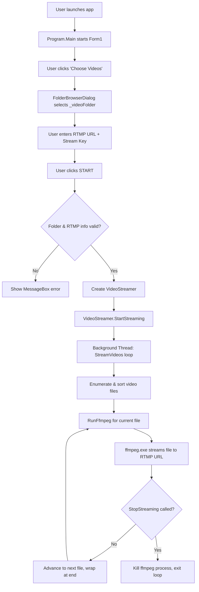
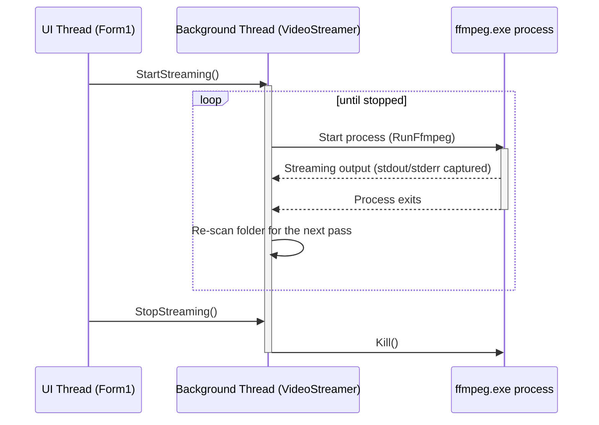

# Architecture Overview

EZInfiniteYTLive follows a simple two-layer architecture typical of small WinForms utilities: a **UI layer** (`Form1`) and a **worker layer** (`VideoStreamer`) that does the actual work on a background thread, keeping the UI responsive.

## High-level flow

## Components

### `Program` (entry point)

Starts the WinForms message loop and shows `Form1`. See [API Reference → Program](../api-reference/program.md).

### `Form1` (UI / controller)

- Owns the UI state: selected folder, shuffle flag, FFmpeg path.
- Validates user input (folder exists, RTMP URL/stream key present, and FFmpeg is resolvable).
- Builds the full RTMP destination string.
- Creates, starts, stops, and disposes a single `VideoStreamer` instance per stream session.
- Never touches FFmpeg directly — it delegates all of that to `VideoStreamer`.

See [API Reference → Form1](../api-reference/form1.md).

### `VideoStreamer` (streaming engine)

- Pure logic class (no UI dependencies), implementing `IDisposable`.
- Recursively scans a folder for files with recognized video extensions, taking a fresh snapshot after every playlist pass.
- Runs a dedicated background `Thread` that loops forever over an alphabetically sorted or shuffled file list.
- For each file, spawns an `ffmpeg` process (`Process` + `ProcessStartInfo`) that **stream-copies** (`-c copy`) the file to the destination RTMP URL using the FLV container (`-f flv`), as required by the RTMP protocol.
- Waits for each FFmpeg process to exit before moving to the next file (`process.WaitForExit()`), which gives the "continuous playback" illusion as videos play back-to-back.
- Reports scan, startup, and FFmpeg exit errors through `ErrorOccurred`.
- Exposes `StartStreaming()` / `StopStreaming()` / `Dispose()` to control the lifecycle from the UI thread.

See [API Reference → VideoStreamer](../api-reference/video-streamer.md).

## Concurrency model

- `StartStreaming()` spawns a single background `Thread` (`IsBackground = true`, so it won't prevent app exit).
- That thread owns the loop; it is the only thread that starts FFmpeg processes.
- `StopStreaming()` (called from the UI thread) sets a `_stopRequested` flag and force-kills the currently running FFmpeg process via `Process.Kill()`, which unblocks the background thread's `WaitForExit()` call so the loop can observe `_stopRequested` and exit promptly.
- Because only one `_ffmpegProcess` field is tracked at a time, only one FFmpeg process is ever running per `VideoStreamer` instance.

## Design characteristics & trade-offs

- **Simplicity over configurability**: no playlist persistence, no re-encoding options, no bitrate/resolution controls exposed in the UI — this keeps the tool approachable, but also limits flexibility.
- **Stream copy (`-c copy`)**: avoids CPU-intensive re-encoding, so the app can run24/7 on modest hardware, but requires your source files to already be in an RTMP/FLV-compatible codec.
- **Recursive, extension-filtered folder scan**: nested folders are included, and each pass reflects files added or removed while streaming.
- **Thread + Process, not `async`/`await`**: the codebase favors a classic dedicated-thread + blocking-process model, which is simple to reason about for a single always-on worker loop.
